# Dota 2 Draft Analyzer

A data-driven draft analysis tool that evaluates team compositions based on ability-level features, timing, and matchup interactions.

This project is designed to explain **why a game played out the way it did**, not just who won.

---

## 📌 Overview

Most players evaluate games based on outcome or individual performance.

This tool focuses on **draft structure**:

* What each team is capable of doing
* What each team is missing
* How those capabilities interact

It helps answer questions like:

* Why did this game feel unwinnable?
* Was the draft structurally weak?
* What conditions were required to win?

---

## 🧠 Core Idea

Instead of relying on win rates or meta statistics, this project models gameplay by breaking abilities into functional components.

Each ability is expressed using **tags** that represent what it actually does (burst, sustain, control, etc.).

These tags are then evaluated across:

* team composition
* timing (early vs late)
* matchup interactions

---

## ⚙️ How It Works

### 1. Ability Tagging

Each ability is mapped to a set of tags that describe its function:

```json
"abaddon_death_coil": ["burst", "heal"]
```

These tags are **manually defined and standardized** to ensure consistency.

---

### 2. Tag System

Tags represent gameplay capabilities, such as:

* burst
* dps
* sustain
* control
* push
* defensive utility

Each tag has a clear meaning and is used consistently across all abilities.

---

### 3. Timing Model

Each tag has a **timing factor** that determines when it is most impactful:

* early game
* mid game
* late game

This allows the system to model tempo differences between drafts.

---

### 4. Matchup Interaction

Tags are evaluated against each other using a **counter system**.

Examples:

* sustain vs burst
* defense vs sustained damage
* control vs mobility

This determines how effective a team is against the opposing draft.

---

### 5. Team Evaluation

Teams are evaluated based on:

* overall structure
* strengths and weaknesses
* timing advantage
* execution difficulty

---

## 🔍 Example Insights

* High push vs low defense → fast game
* High pickoff vs low survivability → high kill tempo
* Even drafts → long, volatile games
* Strong late game vs early pressure → requires defensive play

---

## 🎯 Purpose

This tool is especially useful for:

* post-game analysis
* understanding draft weaknesses
* improving decision-making
* learning how team compositions actually function

It is intended to make **high-level draft understanding accessible to all players**, not just professionals.

---

## 🛠 Tech Stack

* Next.js
* React
* TypeScript
* Tailwind CSS

---

## 📷 Screenshots

### Draft
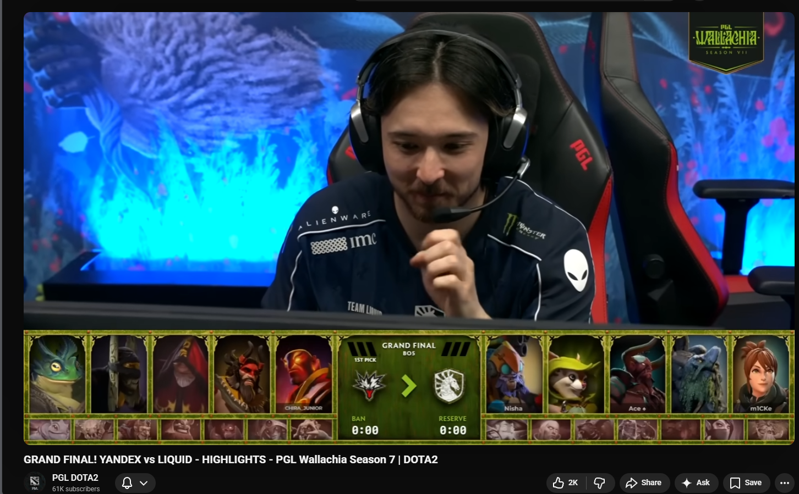
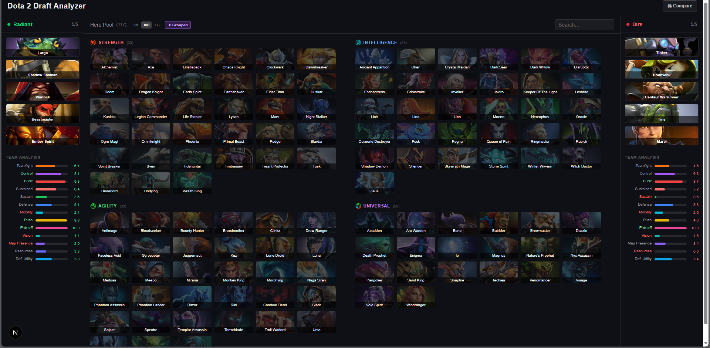

### Outcome
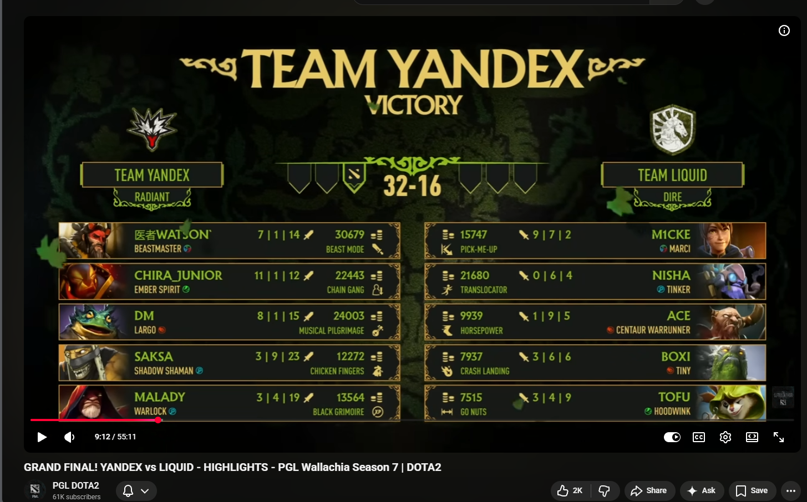
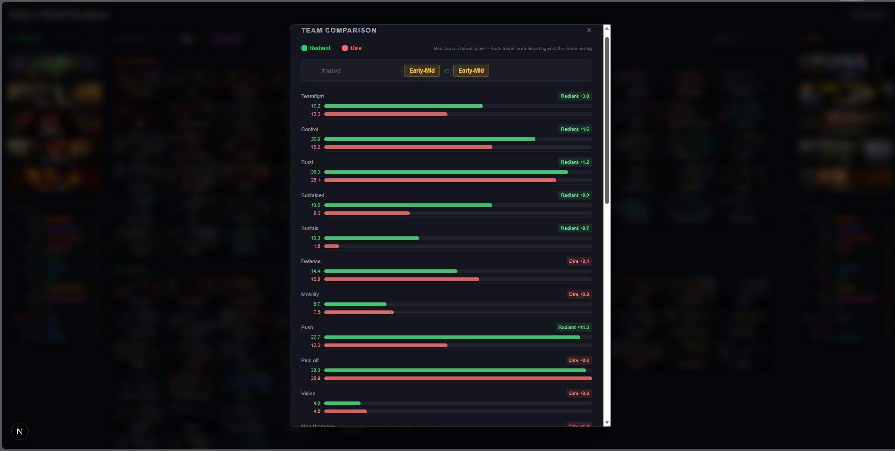 
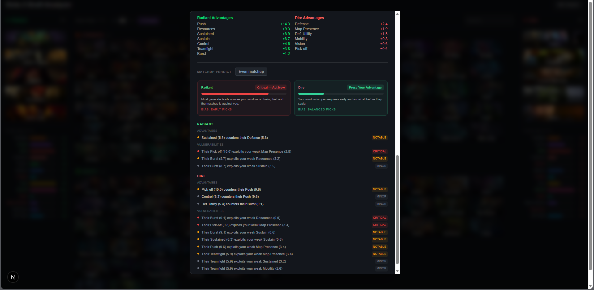 

### Hero Pool
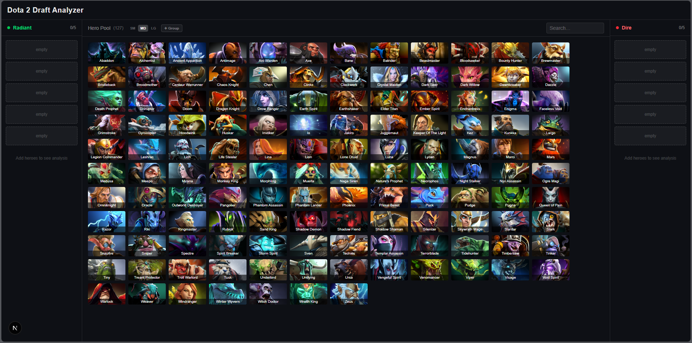
Categorized by primary attribute
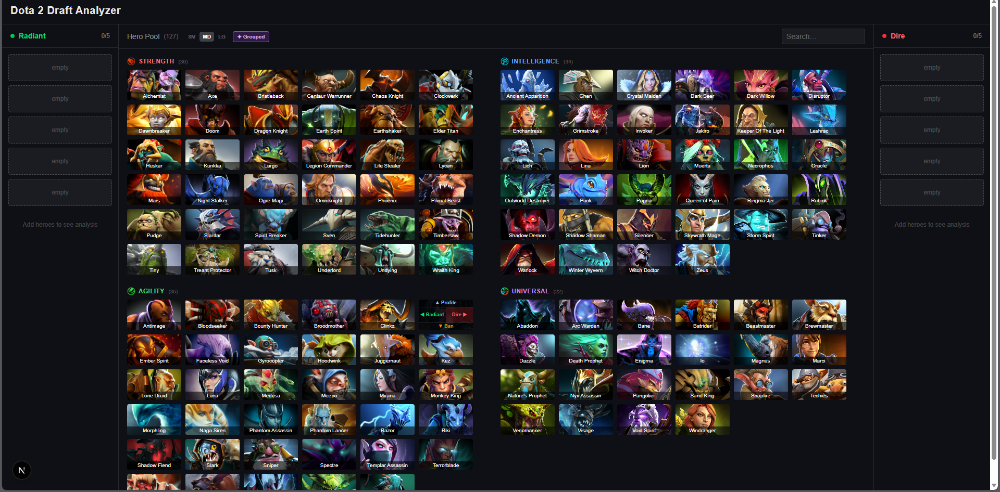

### Hero Profile
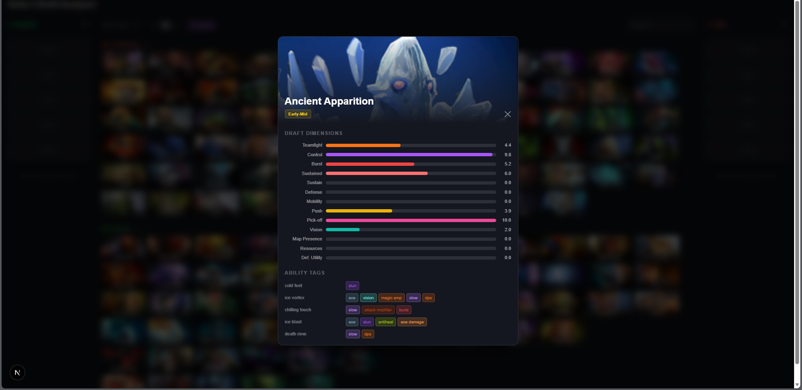

### Hero Selection
Hero Selector
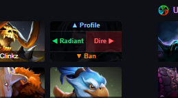
Showing banning functionality
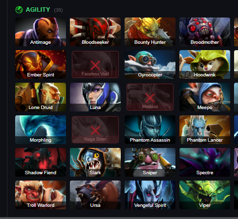
Showing recommended picks a simple dot is a good pick and a star indicates highest impact pick out of remaining pool. *ignores banned heroes
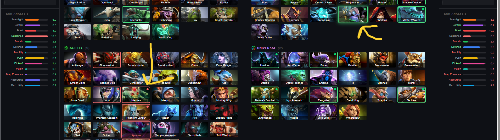


---

## ⚠️ Disclaimer

This is a fan-made project and is not affiliated with Valve.

No proprietary game files or raw data are included in this repository.
All ability tags and systems are original and derived from independent analysis.

---

## 🚀 Future Improvements

* Improve recommendation system
* Expand tag interaction logic
* Enhance UI and visualization
* Add more detailed game flow explanations
